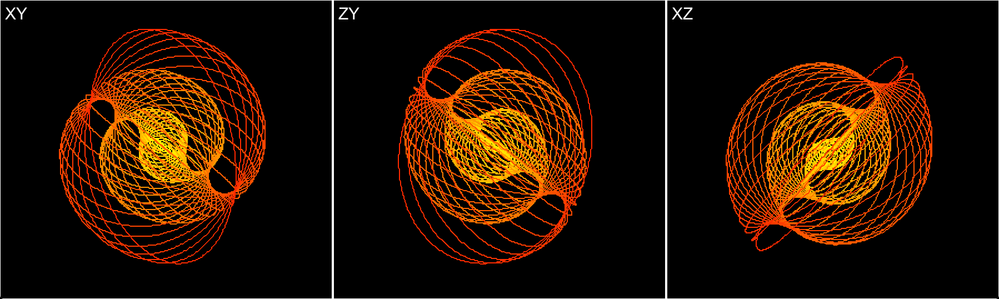
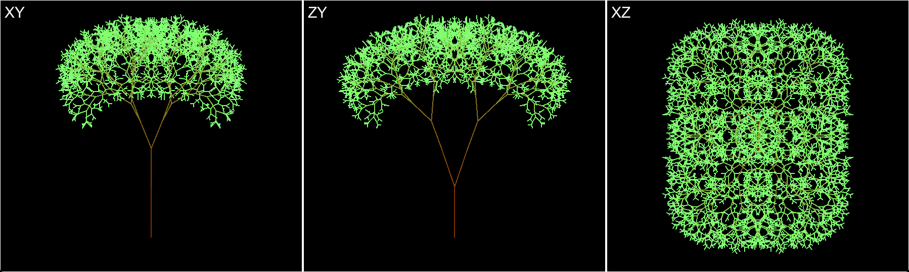

# Logo3d

A compiler for the [Logo programming language](https://en.wikipedia.org/wiki/Logo_%28programming_language%29) featuring language extensions for navigations in three-dimensional space. The compiler takes a logo3d program string and outputs a collection of colored lines defined in terms of their X, Y, & Z coordinates.

The compiler is provided as 'headless' - it is hoped that developers with UI expertise can provide application front ends and GL acceleration appropriate for each target platform. However, to demonstrate the power of Logo3d the project does contain a simple [DemoVisualizer](src/main/java/com/noelevans555/logo3d/DemoVisualizer.java) along with three [predefined programs](src/main/java/com/noelevans555/logo3d/DemoPrograms.java):


**GRID_SPHERE**


**SPIRAL_SHELL**



**RECURSIVE_TREE**



## Prerequisites

The following dependencies are needed to build the project and run the demo application.

* Java, version 11+
* [Maven](https://maven.apache.org/)

## Running the demo application

The demo application is run from the downloaded/cloned project directory, i.e. the directory containing `pom.xml`.

To run the demo application:

```
mvn exec:java
```

The demo application runs GRID_SPHERE from the [predefined programs](src/main/java/com/noelevans555/logo3d/DemoPrograms.java). An alternative program, or custom program string, can be specified [here](https://github.com/noelevans555/logo3d/blob/master/src/main/java/com/noelevans555/logo3d/DemoApplication.java#L36).

## Running the tests

The project contains unit tests, static analysis tests ([SpotBugs](https://spotbugs.github.io/)), code coverage tests ([JaCoCo](https://www.jacoco.org/jacoco/)) and code style tests ([Checkstyle](https://checkstyle.sourceforge.io/)). To run all, specify:

```
mvn verify
```

Verification will fail if any test(s) fail. Code coverage thresholds are set at 90% for both line and branch coverage. The code coverage report is written to `target/site/jacoco/index.html`

Checkstyle is used to enforce the Sun coding conventions, see: [checkstyle.xml](./checkstyle.xml)

## Key implementation classes

| Class | Responsibility |
| --- | --- |
| [Tokenizer](src/main/java/com/noelevans555/logo3d/compiler/program/tokens/Tokenizer.java) | Splits a Logo3d program defined as a single string into its constituent tokens, e.g. "make x=x+1" becomes  ["make", "x", "=", "x", "+", "1"]. |
| [Instruction](src/main/java/com/noelevans555/logo3d/compiler/program/instruction/Instruction.java) | Operations that can be performed as part of a Logo3d program, e.g. [MoveForward](src/main/java/com/noelevans555/logo3d/compiler/program/instruction/MoveForward.java), [TurnLeft](src/main/java/com/noelevans555/logo3d/compiler/program/instruction/TurnLeft.java), [SetColor](src/main/java/com/noelevans555/logo3d/compiler/program/instruction/SetColor.java), [Make](src/main/java/com/noelevans555/logo3d/compiler/program/instruction/Make.java) and [Repeat](src/main/java/com/noelevans555/logo3d/compiler/program/instruction/Repeat.java). |
| [Parameter](src/main/java/com/noelevans555/logo3d/compiler/program/parameter/Parameter.java) | An input to a Logo3d [Instruction](src/main/java/com/noelevans555/logo3d/compiler/program/instruction/Instruction.java). Example parameters are simple (e.g. [NumericConstant](src/main/java/com/noelevans555/logo3d/compiler/program/parameter/NumericConstant.java)), dynamic (e.g. [Pick](src/main/java/com/noelevans555/logo3d/compiler/program/parameter/Pick.java)), compound (e.g. [Expression](src/main/java/com/noelevans555/logo3d/compiler/program/parameter/Expression.java)) or variable (e.g. [VariableReference](src/main/java/com/noelevans555/logo3d/compiler/program/parameter/VariableReference.java)). |
| [Result](src/main/java/com/noelevans555/logo3d/compiler/program/parameter/result/Result.java) | The realtime value of a [Parameter](src/main/java/com/noelevans555/logo3d/compiler/program/parameter/Parameter.java) when evaluated at runtime. Results may either be of type [NumericResult](src/main/java/com/noelevans555/logo3d/compiler/program/parameter/result/NumericResult.java) or [ColorResult](src/main/java/com/noelevans555/logo3d/compiler/program/parameter/result/ColorResult.java), both of which can be combined with results of the same type using mathematical operators. |
| [Program](src/main/java/com/noelevans555/logo3d/compiler/program/Program.java) | The representation of all the [Instructions](src/main/java/com/noelevans555/logo3d/compiler/program/instruction/Instruction.java) and their bound [Parameters](src/main/java/com/noelevans555/logo3d/compiler/program/parameter/Parameter.java) that constitute a Logo3d program. |
| [Procedure](src/main/java/com/noelevans555/logo3d/compiler/program/Procedure.java) | A named sub-program defined within a Logo3d program. |
| [State](src/main/java/com/noelevans555/logo3d/compiler/state/State.java) | A store for recording the current value of any [VariableReference](src/main/java/com/noelevans555/logo3d/compiler/program/parameter/VariableReference.java) parameters. The state observes correct scoping rules, i.e. variables defined within a [Procedure](src/main/java/com/noelevans555/logo3d/compiler/program/Procedure.java) or [Repeat](src/main/java/com/noelevans555/logo3d/compiler/program/instruction/Repeat.java) body exist independently of variables of the same name defined in the wider [Program](src/main/java/com/noelevans555/logo3d/compiler/program/Program.java). |
| [Turtle](src/main/java/com/noelevans555/logo3d/compiler/turtle/Turtle.java) | An entity which is manipulated within three dimensional space while recording the positions of traversed lines. |
| [LogoCompiler](src/main/java/com/noelevans555/logo3d/compiler/LogoCompiler.java) | The process orchestrator. Constructs all entities and runs a built [Program](src/main/java/com/noelevans555/logo3d/compiler/program/Program.java) with a fresh [State](src/main/java/com/noelevans555/logo3d/compiler/state/State.java) and [Turtle](src/main/java/com/noelevans555/logo3d/compiler/turtle/Turtle.java). |

## Author

Concept, design & implementation by [Noel Evans](https://www.linkedin.com/in/noelevans/)

## License

This project is licensed under the MIT License - see the [LICENSE.txt](LICENSE.txt) file for details.

## Acknowledgments

* Thanks to [Benoit](https://github.com/bsouffle) for code reviews.
* [Dan Mellinger](https://www.linkedin.com/in/daniel-mellinger-35909648/) for collaboration on the earlier iOS implementation.
* [PurpleBooth](https://github.com/PurpleBooth), for this README template.

